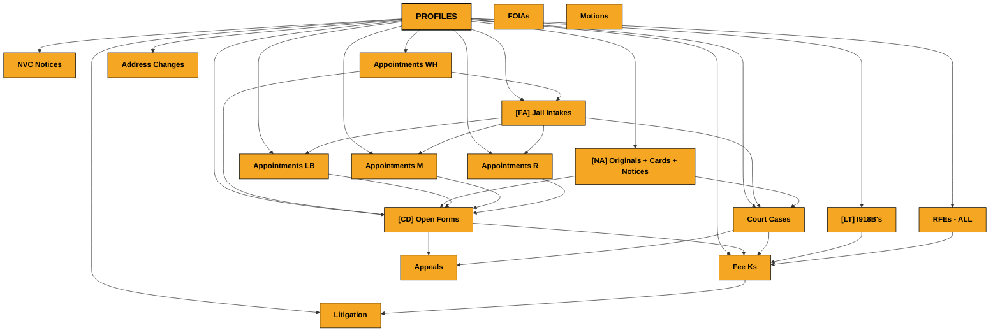

# Board Relationship Map

> Last updated: Friday, February 6, 2026

## Structure

---

## Summary

**Main Board:** Profiles

- **18** boards
- **72** connections
- **146** mirror columns (shared data)

---

## Board Details

### NVC Notices

**Links to:**
- Profiles (via "Profile")

**Displays from linked boards:**
- A Number
- Phone Number
- E-mail

### Appointments WH

**Links to:**
- [FA] Jail Intakes (via "link to Jail Intakes")
- Profiles (via "Profiles")
- [FA] Jail Intakes (via "Jail Intakes")
- [FA] Jail Intakes (via "link to Jail Intakes")
- Profiles (via "link to Profiles")
- [CD] Open Forms (via "link to Open Forms")

**Displays from linked boards:**
- Create Fee K?
- Case Type(s)
- Case No.
- E-File
- Projects
- Fee Ks
- Paralegal
- Files (P)
- PROFILE ID
- Consult File
- Jail intake ID

### [FA] Jail Intakes

**Links to:**
- Court Cases (via "link to Court Cases")
- Appointments R (via "X Appointments")
- Appointments LB (via "X Appointments")
- Appointments M (via "X Appointments")
- Appointments WH (via "X Appointments")

**Displays from linked boards:**
- Profiles

### [NA] Originals + Cards + Notices

**Links to:**
- Profiles (via "Profiles")
- [CD] Open Forms (via "[CD] Open Forms")
- [CD] Open Forms (via "link to [CD] Open Forms")
- Court Cases (via "Court Cases")

**Displays from linked boards:**
- Projects
- Fee Ks
- E-mail
- Phone
- Phone number
- Language
- Profile Status
- Address
- Form
- E-File

### FOIAs

### [CD] Open Forms

**Links to:**
- Fee Ks (via "Fee Ks")
- Profiles (via "Profiles")
- Appeals (via "link to Appeals")

**Displays from linked boards:**
- A Number
- Case No.
- E-File
- Consult
- Project
- Fee Ks
- E-Mail
- Phone
- FF
- Profile
- Profile Status
- Interview Location
- Interview Date - Calendaring
- PS Deadline
- FF from Fee K

### Motions

### Court Cases

**Links to:**
- Profiles (via "Profile")
- Appeals (via "Motions")
- [NA] Originals + Cards + Notices (via "link to [NA] Originals + Cards + Notices")
- Fee Ks (via "link to Fee Ks")
- [FA] Jail Intakes (via "[FA] Jail Intakes")

**Displays from linked boards:**
- COUNTRY
- Motions - Connected
- A-Number
- E-File
- Judge - Connected
- Hearing Date - Calendaring
- Calendaring Status - From Calendaring
- Deadline List
- Written - COURT - Calendaring
- Due Date - COURT - Calendaring
- Warning - COURT - Calendaring
- TO DO - Deadlines List Update - MR Comment
- Master Fees Due On: - Calendaring
- TP Fees Due: - Calendaring
- Trial Fees Due On: - Calendaring
- Consults
- Projects
- Fee K
- Phone
- E-Mail
- Address
- Profile Status
- Case No.
- Mirror 1
- Create Fee K?
- Mirror

### [LT] I918B's

**Links to:**
- Fee Ks (via "link to Fee Ks")
- Profiles (via "Profile")

**Displays from linked boards:**
- Case No.
- E-File
- Consult
- Projects
- Fee Ks

### Address Changes

**Links to:**
- Profiles (via "Profiles")

**Displays from linked boards:**
- Case No.
- CaseTypes
- Consults
- Projects
- Fee Ks
- Address
- E-File
- Phone
- E-mail

### RFEs - ALL

**Links to:**
- Fee Ks (via "Fee K")
- Profiles (via "Profile")

**Displays from linked boards:**
- E-File
- Consults
- Projects
- Fee Ks
- E-mail
- Phone
- Address
- Notice - Calendaring
- Type - Calendaring
- Due Date - Calendaring
- Warning - Calendaring
- Issue Date - Calendaring
- Written - Calendaring

### Fee Ks

**Links to:**
- Court Cases (via "Court Cases - Connected -")
- Profiles (via "Profile")
- [CD] Open Forms (via "link to [CD] Open Forms")
- RFEs - ALL (via "Cases")
- [LT] I918B's (via "Cases")
- Court Cases (via "Cases")
- [CD] Open Forms (via "Cases")
- Litigation (via "Cases")

**Displays from linked boards:**
- Case No.
- E-File
- COURT - Payment History Log
- Address
- E-mail
- Phone
- Consult
- Activities
- Projects
- Jail Intake / Appointment
- A Number
- Projects
- Note Sheet
- PAYMENT LOG
- Language

### Appointments LB

**Links to:**
- [FA] Jail Intakes (via "link to Jail Intakes")
- Profiles (via "Profiles")
- [FA] Jail Intakes (via "Jail Intakes")
- [FA] Jail Intakes (via "link to Jail Intakes")
- Profiles (via "link to Profiles")
- [CD] Open Forms (via "link to Open Forms")

**Displays from linked boards:**
- Create Fee K?
- Case Type(s)
- Case No.
- E-File
- Projects
- Fee Ks
- Paralegal
- Files (P)
- PROFILE ID
- Consult File

### Appointments M

**Links to:**
- Profiles (via "Profiles")
- [FA] Jail Intakes (via "link to Jail Intakes")
- [FA] Jail Intakes (via "Jail Intakes")
- Profiles (via "link to Profiles")
- [CD] Open Forms (via "link to Open Forms")

**Displays from linked boards:**
- Create Fee K?
- Case Type
- Case No.
- Pronouns
- CLIENT - E-File
- Case Type
- Projects
- Fee Ks
- Paralegal
- PROFILE ID
- Consult File

### Profiles (Main)

**Links to:**
- Appointments R (via "Appointments")
- Appointments M (via "Appointments")
- Appointments LB (via "Appointments")
- [FA] Jail Intakes (via "Appointments")
- Appointments WH (via "Appointments")
- Fee Ks (via "Fee Ks")
- RFEs - ALL (via "Projects")
- [LT] I918B's (via "Projects")
- Court Cases (via "Projects")
- [CD] Open Forms (via "Projects")
- Address Changes (via "Projects")
- [NA] Originals + Cards + Notices (via "Projects")
- Litigation (via "Projects")
- Appointments LB (via "Projects")
- Appointments R (via "Projects")
- Appointments M (via "Projects")
- Appointments WH (via "Projects")
- NVC Notices (via "Projects")

**Displays from linked boards:**
- Contract Stage
- Hire Date
- Last Consult Date
- Mirror
- IJ
- Receipt Number(s)
- Paralegal
- CaseTypes

### Appeals

### Appointments R

**Links to:**
- Profiles (via "Profiles")
- [FA] Jail Intakes (via "Jail Intakes")
- Profiles (via "link to Profiles")
- [CD] Open Forms (via "link to Open Forms")

**Displays from linked boards:**
- Create Fee K?
- Case Type(s)
- Case No.
- Projects
- Fee Ks
- Paralegal
- Mirror
- PROFILE ID
- Consult File

### Litigation

**Links to:**
- Profiles (via "Profile")
- Fee Ks (via "link to Fee Ks")

---

Generated: 2026-02-07T00:29:10.602Z
